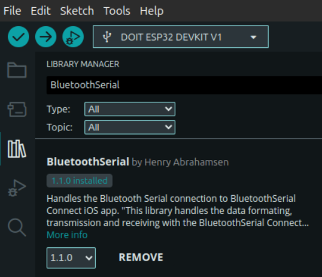

AI-powered third-arm prosthesis using an EMG sensor and imitation learning policy (ACT) 

Built for the  LeRobot Worldwide Hackathon 2025 by Hugging Face (🏆 13ᵗʰ place out of the 30 winning projects).

**Authors:** Baptiste LUBRANO LAVADERA, Erwan MARTIN

<p align="left">
  
  
</p>

We created a custom dataset using a wearable SO100 arm attached to a backpack, equipped with both a wrist camera and a context camera. Additionally, a MyoWare EMG sensor was employed to record the muscle activity of the user, and this data was incorporated into the observation space of the robot.

Our objective was to create the world's first — to the best of our knowledge — LeRobot Cyborg 🦾 dataset and AI policy to control a third arm.

### 🎥 <a href="https://youtu.be/OB96s5SZWGA">Watch the demo video</a> 🎥 

# Requirements
LeCyborg is working on top of lerobot (https://github.com/huggingface/lerobot), thus, you need it installed properly in a proper environment (the best would be to be familiar with the full lerobot dataset record and training process).

INFO : This project has been made on machines running ubuntu 22 and 24 operating system.

# Getting Started
```bash
git clone https://github.com/Mr-C4T/LeCyborg.git \
cd LeCyborg
```
Make sure your lerobot environment is activated.

## EMG Sensor

You can build the LeCyborg EMG sensor in two different ways depending on your tools and needs:

### 1. 3D-Printed Case + ESP32 DevKit
   
<p align="left">
  
  
</p>

- Simple and fast prototype

- Uses ESP32 DOIT DevKit

- Housed in a 3D-printed case

- Powered via a small 1 S LiPo

- Ideal if you want to quickly test the system


### 2. Custom PCB + ESP32-C3 XIAO

<p align="center">  </p>

- Compact, professional design

- Based on the ESP32-C3 XIAO (also compatible with XIAO-S3)

- Direct connector for MyoWare EMG sensor

- Wireless transmission with ESP-NOW (or bluetooth serial if you use XIAO-S3)

- Powered via a small 1 S LiPo

The PCB was kindly sponsored by PCBWay
They manufactured the boards with great quality and fast shipping — highly recommended if you want to reproduce this setup!
You can find the Gerber files in the pcb/ folder of this repo.
If you’d like to order the board directly, you can upload the Gerbers to PCBWay.

https://pcbway.com/g/jT8zNZ

### ESP32 Flashing
With your ESP32, use the `LeCyborg-esp32.ino` code placed in the **esp32/** folder.

You can flash it with the arduino software (https://www.arduino.cc/en/software/).
You will also need to install the BluetoothSerial Library which can be easily found on the library manager of the arduino IDE.



### Connecting and getting data from the sensor in python
First, Turn on your Bluetooth and scan to find the MAC address of your ESP32:
```bash
hcitool scan
```
Then, when you find the MAC address of you bluetooth ESP device in the shape XX:XX:XX:XX:XX:XX, copy it.

The sensor should appear as **"🤗 LeCyborg-EMG 🦾"**

we can now open our bash file : 
```bash
nano LeCyborg-connect.sh 
```
edit the mac address by removing the existing one and pasting the one you copied above.
you can now save and exit from the file by doing **CTRL+O->ENTER->CTRL+X**

just to be sure, add the execution rights to the file and run it:
```bash
sudo chmod +x LeCyborg-connect.sh
./LeCyborg-connect.sh
```
Note that you'll have to run **LeCyborg-connect.sh** every time you open a terminal where you want to use the sensor.

Then, we are ready to run the python test script:
```bash
python LeCyborg/test_biosensor_print.py
```

you should see similar outputs as in the image below:

You are now ready to record a dataset with your new sensor!!

## Contextual Activation

To teach the AI policy when to activate the third arm, we contracted the muscle only when assistance was actually needed during recording. This made the EMG signal a clear indicator of intent, enabling the model to learn context-aware activation, rather than relying on fixed thresholds like traditional myoelectric prostheses.

The teleoperator was instructed to activate the robot only when the cyborg’s muscle was contracted, and return it to a rest position when the muscle was relaxed.

## Record
We've made a custom script : **LeCyborg/custom_record.py** which is a modified version of the record script from lerobot. We modified the record loop in order to integrate our sensor data.

you can modify those variables after the program imports :
```python
BIOSENSOR_PORT = "/dev/rfcomm0" #MODIFY HERE
BIOSENSOR_BAUDRATE = 115200 #74880

warmup_time = 35
```

please note that the warmup time variable corresponds to a waiting time for the global recording to begin (not for every loop iteration) made because of a sensor bug in the 30 first seconds after connexion.

Here is a command you can adapt to start your dataset recording:
```bash
cd LeCyborg
```
```bash
python custom_record.py     --robot.type=so100_follower     --robot.port=/dev/ttyACM1     --robot.id=so100_follower     --robot.cameras="{ wrist: {type: opencv, index_or_path: /dev/video8, width: 640, height: 480, fps: 25}, context: {type: intelrealsense, serial_number_or_name: 134322073085, width: 640, height: 480, fps: 15}}"     --teleop.type=so100_leader   --teleop.port=/dev/ttyACM0 --teleop.id=so100_leader   --display_data=false     --dataset.repo_id=USER/record-test     --dataset.num_episodes=20     --dataset.single_task="put the cube in the box"     --dataset.push_to_hub=False
```
You can see that the parameters are the same that for lerobot script, adapt every parameter to your case.
As in lerobot, think about giving rights to the serial ports for the robots

If you want to see what we changed in the record loop in order to add sensor data, you can CTRL+F and look for comments containing "MODIFIED" in `LeCyborg/custom_record.py`

LeCyborg dataset: [LeRobot-worldwide-hackathon/7-LeCyborg-so100_emg_sensor](https://huggingface.co/datasets/LeRobot-worldwide-hackathon/7-LeCyborg-so100_emg_sensor)

## Visualize dataset
once you have it, you can visualize your dataset using the scripts directly from lerobot.

```bash
python PATH_TO_lerobot/lerobot/scripts/visualize_dataset_html.py --repo-id=USER/record-test
```

With that script you can view your dataset in your web brower:


You can see our additional emg data labeled as **observation.sensor**

Alternatively, you can view your dataset online here: [lerobot-visualize-dataset.hf.space](https://lerobot-visualize-dataset.hf.space/LeRobot-worldwide-hackathon/7-LeCyborg-so100_emg_sensor/episode_0)

## Train
Same as for view, you can use the official lerobot training script to train your policy (we used ACT):
```bash
python lerobot/scripts/train.py   --dataset.repo_id=MrC4t/7-LeCyborg-so100_emg_sensor   --policy.type=act   --output_dir=outputs/train/LeCyborg_act --job_name=LeCyborg_act   --policy.device=cuda   --wandb.enable=false
```

Our trained model: [MrC4t/LeCyborg_act](https://huggingface.co/MrC4t/LeCyborg_act)

## Inference
To lunch the LeCyborg_act model inference:
```bash
python custom_record.py     --robot.type=so100_follower     --robot.port=/dev/ttyACM0     --robot.id=so100_follower     --robot.cameras="{ wrist: {type: opencv, index_or_path: /dev/video6, width: 640, height: 480, fps: 25}, context: {type: intelrealsense, serial_number_or_name: 134322073085, width: 640, height: 480, fps: 15}}"     --display_data=false    --dataset.single_task="put the cube in the box"     --dataset.push_to_hub=False --dataset.repo_id=MrC4t/eval_LeCyborg   --policy.path=MrC4t/LeCyborg_act --dataset.episode_time_s=300

```

## Interpretability 

Visual attention mapping + EMG sensor attention graph.
https://github.com/Mr-C4T/physical-AI-interpretability


## ⭐ Star History
If you like the project, consider giving it a star!


